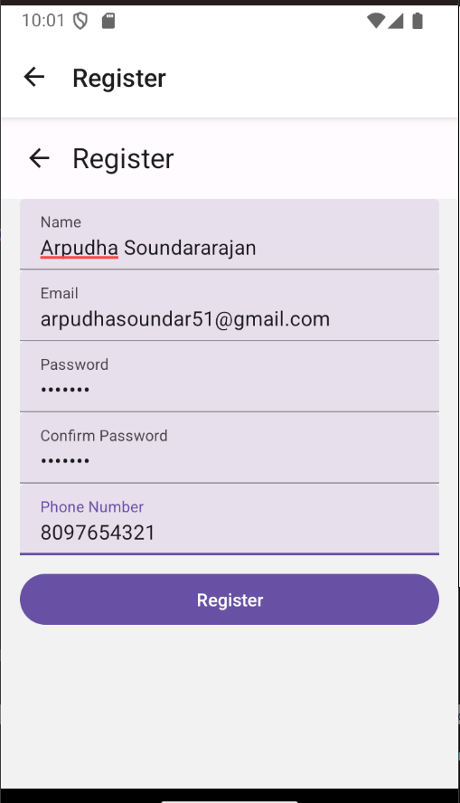
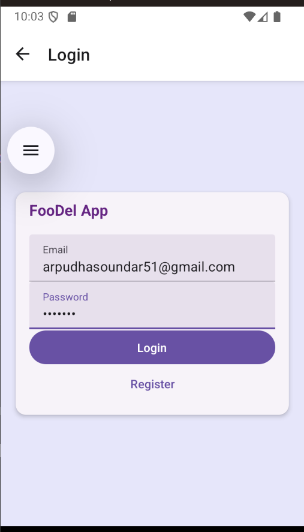
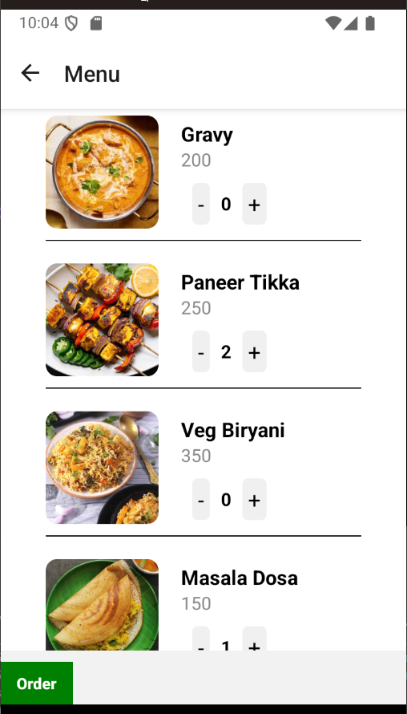
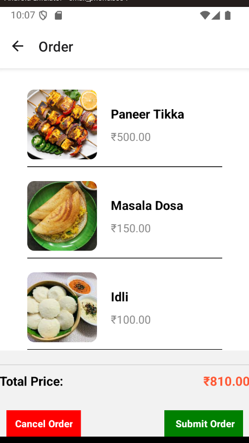
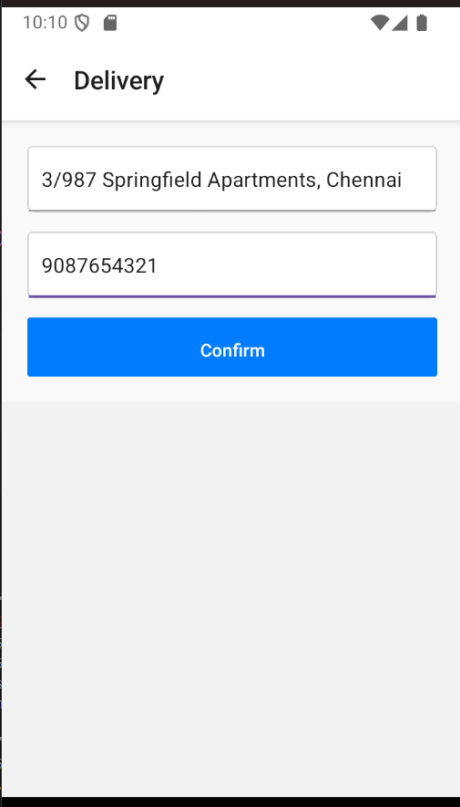
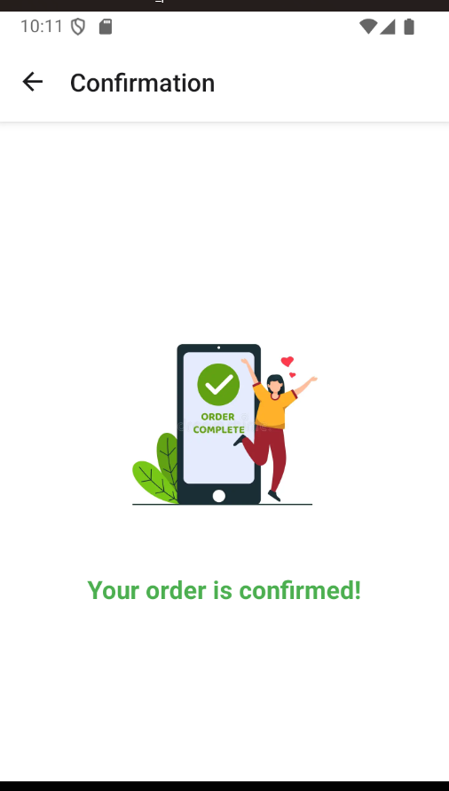
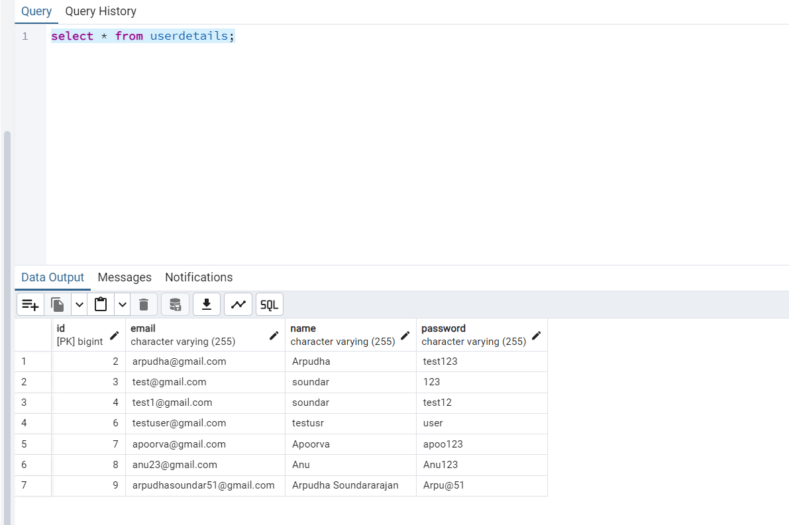
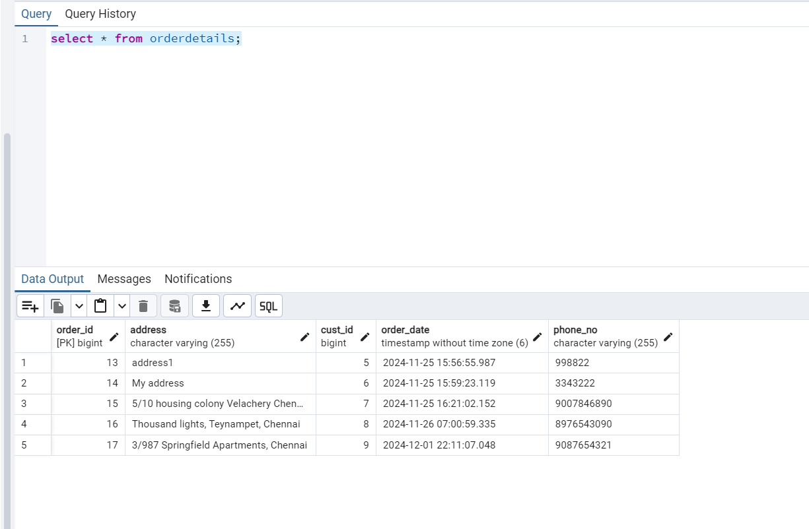
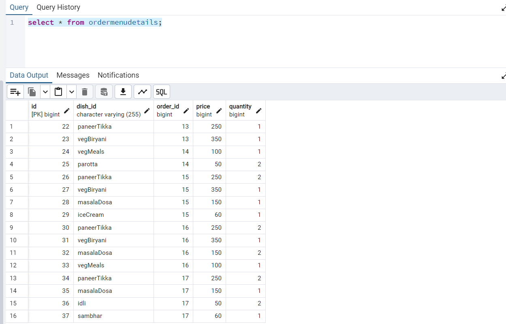

# FooDel - Food Delivery App
## Use Case
   The Foodel App is a dynamic and user-friendly mobile application developed to revolutionize the food ordering process, built with a React Native frontend and a robust Spring Boot backend. This cross-platform application allows users to effortlessly browse an extensive menu of food items, enriched with detailed descriptions and images for a visually engaging experience. Users can select desired dishes, specify quantities, and instantly view the calculated total cost, ensuring a transparent and seamless ordering process. On the back-end, Spring Boot efficiently handles business logic, ensuring smooth communication with the JDBC-connected database, which manages menu details, orders, and user data. The backend, developed with Spring Boot, ensures high performance and reliability, providing APIs for real-time data management and communication.

## Prerequisite
PostgreSQL - Database\
React Native\
Spring Boot - JDBC - connected DB

## Front End
User creates a new account if it does not exist.\

User logs into their account if account does not exist, redirects to register pg.\

User views menu after login.\

User selects food items from menu and places order.\

User enters address for delivery.\

The order conformation message is displayed.\

This database provides the user login details.\

This database provides order details of user.\

This database provides the menu order by customer.\

